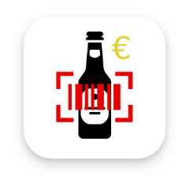
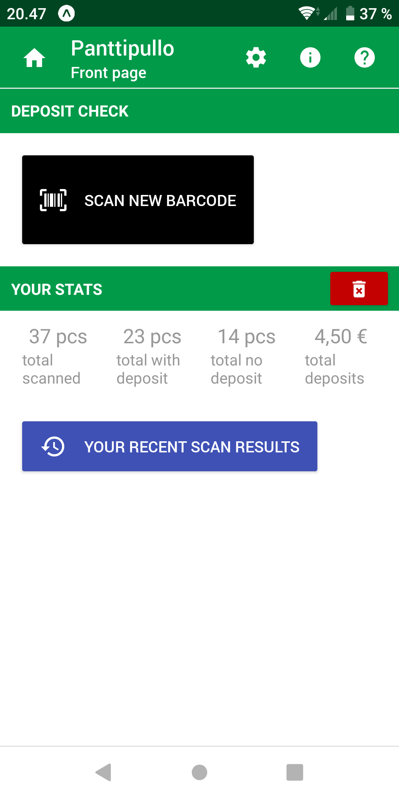
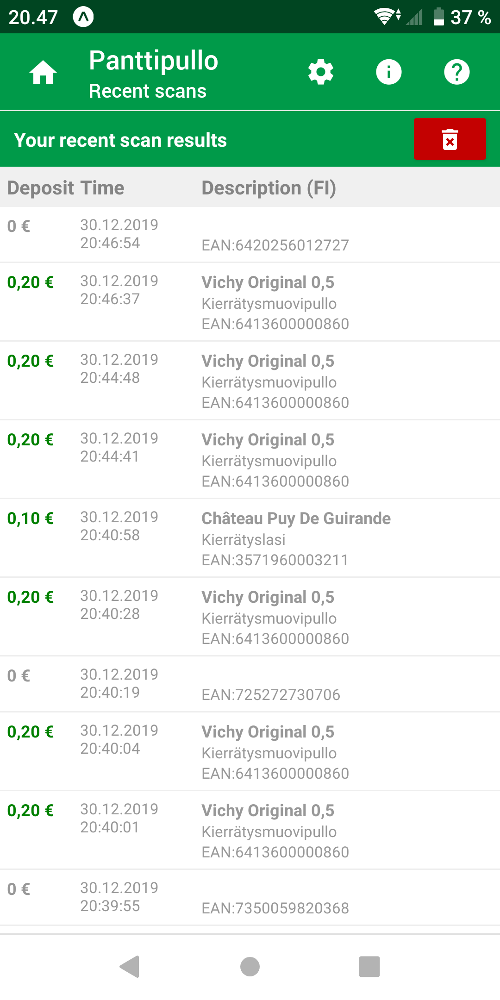
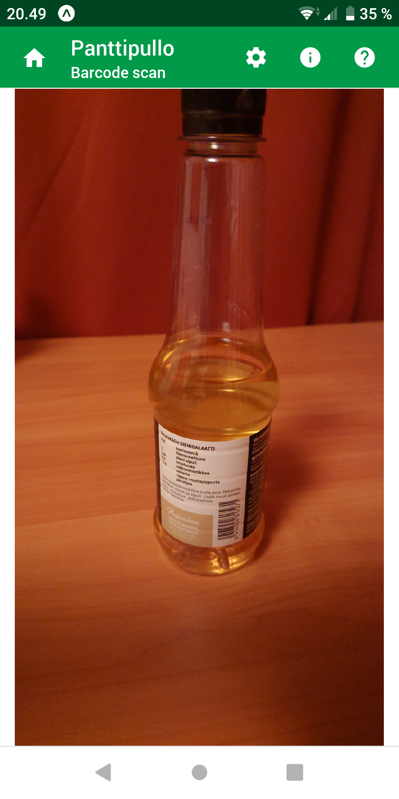
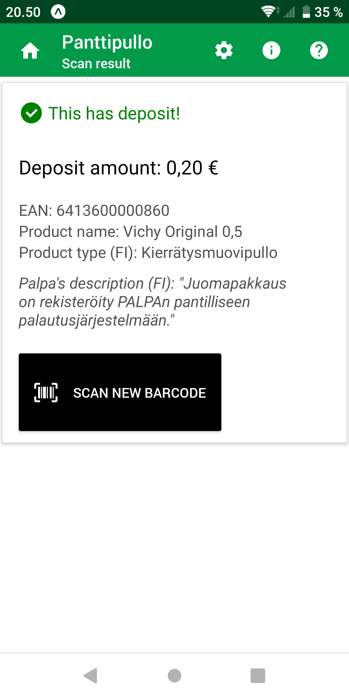
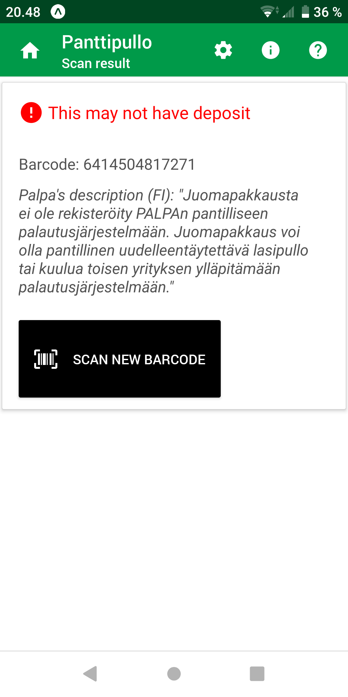
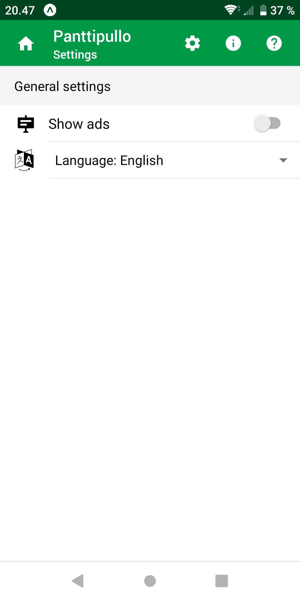
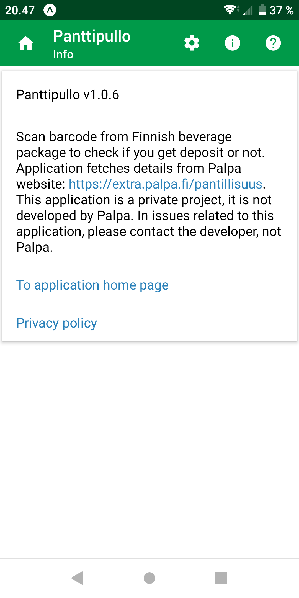
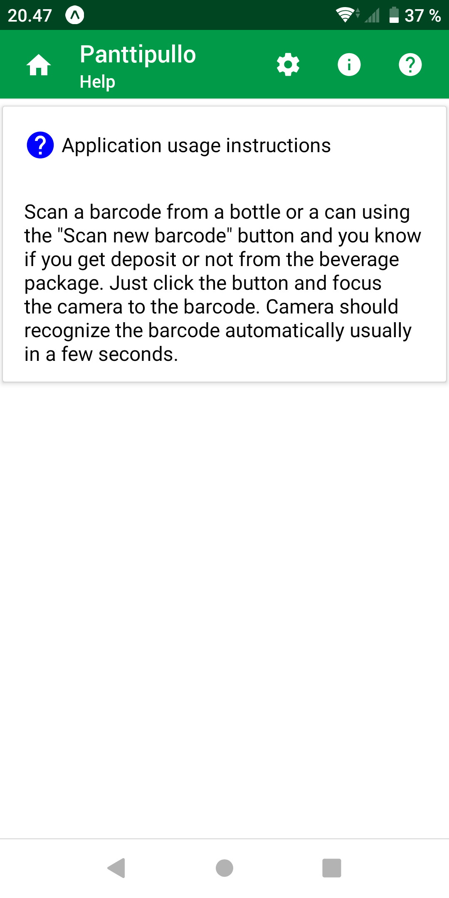

# Panttipullo

## Sovelluksen kuvaus (in Finnish)

Skannaa viivakoodi juomapakkauksesta ja tarkista saako siitä panttia. Tiesitkö, että kaikissa Suomessa myytävissä pantillisissa juomapakkauksissa ei ole Palpan panttimerkintää. Esim. monista Alkon myymistä pulloista puuttuu panttimerkintä, mutta niistä saattaa silti saada pantin. Tämän sovelluksen avulla pystyt helposti skannaamaan viivakoodin pullosta tai tölkistä tarkistaaksesi saako siitä panttia. Sovelluksen avulla voit myös helposti tarkistaa esimerkiksi ruttaantuneen tölkin viivakoodin lukukelpoisuuden ennen tölkin viemistä palautusautomaatille.

Sovellus hakee tiedot [Palpan sivuilta](https://extra.palpa.fi/pantillisuus). 
Sovellus on yksityinen projekti, ei siis Palpan kehittämä.

## Application description

Scan barcode from Finnish beverage package to check if you get deposit or not. Did you know that not all beverage packages sold in Finland have the deposit mark. For example, many bottles bought from the Finnish Alko stores are lacking the deposit mark but you might still get deposit for those bottles also. With the application, you can easily scan barcode from a bottle or a can to check if you get deposit or not in Finland. You can also use the application to check if the barcode in a crumpled can is still readable before taking the can to the recycling machine.

Application fetches deposit information from [Palpa website](https://extra.palpa.fi/pantillisuus). 
This application is a private project, it is not developed by Palpa.

## Supported barcode types

As defined by [Palpa beverage package design instructions](https://www.palpa.fi/materiaalipankki/), 
all beverage packages in Finland should have barcode one of these types: 
EAN-13, EAN-8, UPC-A or UPC-E, thus application is limited to scan only these types of barcodes.

## Supported languages

You can use the application in following languages:
* Finnish
* English
* Swedish

## Screenshots

### Main views

<kbd></kbd> <kbd></kbd> <kbd></kbd> <kbd></kbd> <kbd></kbd>
  
### Support views

<kbd></kbd> <kbd></kbd> <kbd></kbd>

## Download

**Main target platform is Android**. The latest stable version of this application can be downloaded to an Android phone
from [the application website in Google Play Store](https://play.google.com/store/apps/details?id=fi.mvestola.panttipullo&hl=fi).

In addition to Google Play store release, you can use [Expo app release](https://expo.io/@mvestola/Panttipullo) with Android but Play Store version is preferred.

This application will not be released in Apple Store because it is too expensive. In addition, due to [limitations made by Apple](https://blog.expo.io/upcoming-limitations-to-ios-expo-client-8076d01aee1a), you can not use Expo app release with iOS. So sorry, no easy way to run this application in iOS, thanks to Apple. If you want to use this application with iOS, you have to build the application yourself by checking out the code and then run it with Expo client, for example.

## Documentation

* [Development](./docs/DEVELOPMENT.md)
* [Privacy policy](privacy-policy.md)
* [Release notes](RELEASE-NOTES.md)

## Credits

### Logo

Logo uses creative common licenced images from the [Noun project](https://thenounproject.com):
* bottle image by Nikita Kozin from the Noun Project
* barcode scan image by sandra from the Noun Project
