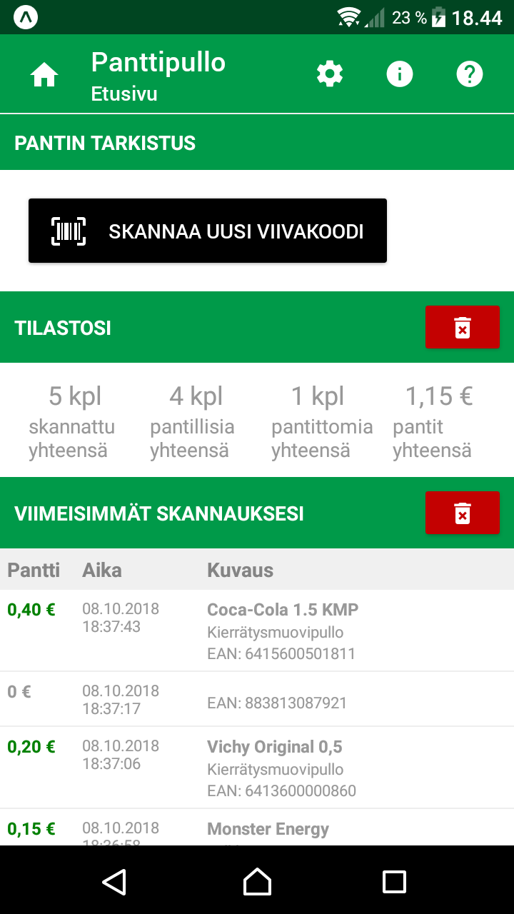
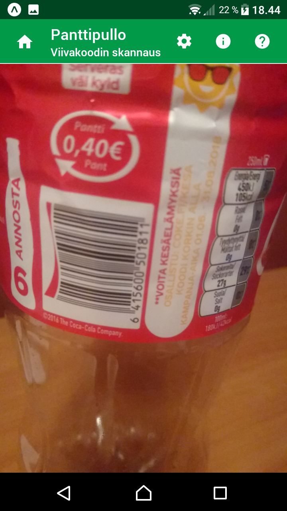
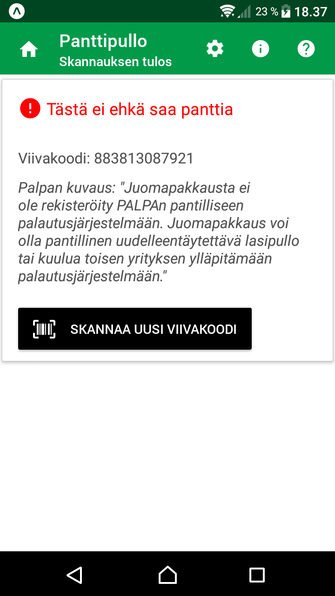
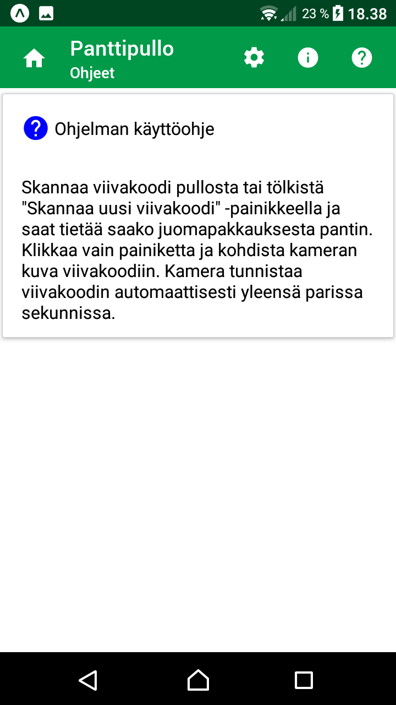
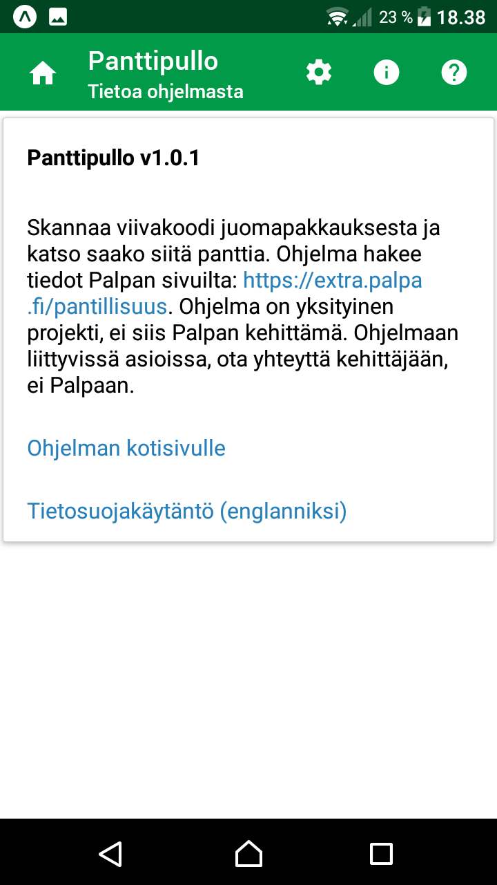
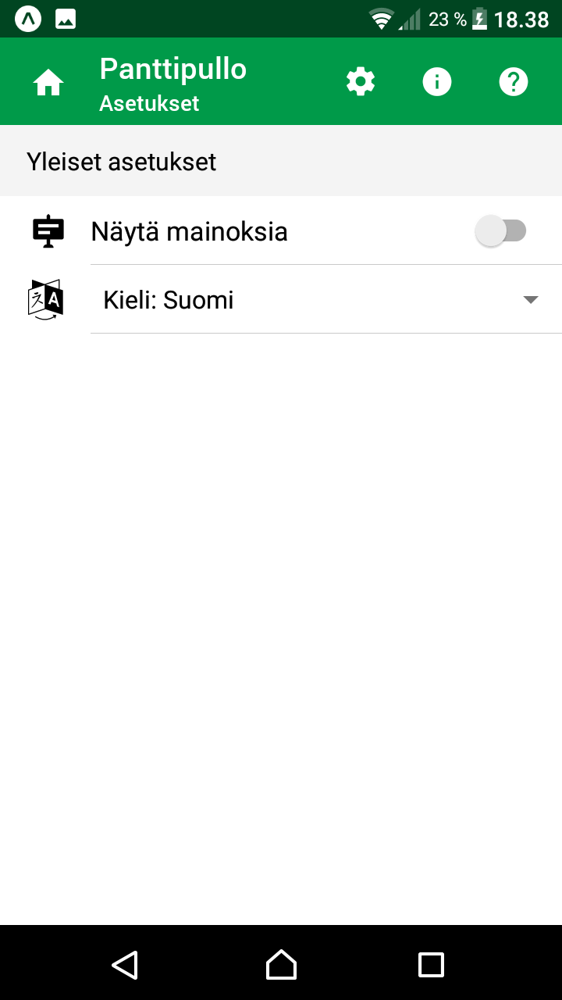

# Panttipullo

## Description

Scan barcode from Finnish beverage package to check if you get deposit or not. 
Did you know that not all beverage packages sold in Finland not have the deposit mark. 
For example, many wine bottles are lacking the deposit mark but you might still get deposit 
for those bottles also. With the application, you can easily scan barcode from e.g. 
wine bottle or soft drink can to check if you get deposit or not in Finland.

Application fetches deposit information from [Palpa website](https://extra.palpa.fi/pantillisuus). 
This application is a private project, it is not developed by Palpa.

## Description (Finnish)

Skannaa viivakoodi juomapakkauksesta ja tarkista saako siitä panttia. Tiesitkö, 
että kaikissa Suomessa myytävissä pantillisissa juomapakkauksissa ei ole Palpan panttimerkintää. 
Esim. monista viinipulloista puuttuu panttimerkintä, mutta niistä saattaa silti saada pantin. 
Tämän sovelluksen avulla pystyt helposti skannaamaan viivakoodin esim. viinipullosta tai tölkistä 
ja tarkistamaan saako siitä panttia. 

Sovellus hakee tiedot [Palpan sivuilta](https://extra.palpa.fi/pantillisuus). 
Sovellus on yksityinen projekti, ei siis Palpan kehittämä.

## Screenshots

### Main views

<kbd>
   
</kbd>
  
### Support views

<kbd>
  
</kbd>

## Download

**Main target platform is Android**. The latest stable version of this application can be downloaded to an Android phone
from [the application website in Google Play Store](https://play.google.com/store/apps/details?id=fi.mvestola.panttipullo).

App will not be in Apple Store. For iOS, use [Expo app release](https://expo.io/@mvestola/Panttipullo), but note that it is not tested with iOS.

## Documentation

* [Development](./docs/DEVELOPMENT.md)
* [Privacy policy](privacy-policy.md)
* [Release notes](RELEASE-NOTES.md)

## Credits

### Logo

Logo uses creative common licenced images from the [Noun project](https://thenounproject.com):
* beer bottle by Nikita Kozin from the Noun Project
* scan barcode by sandra from the Noun Project
