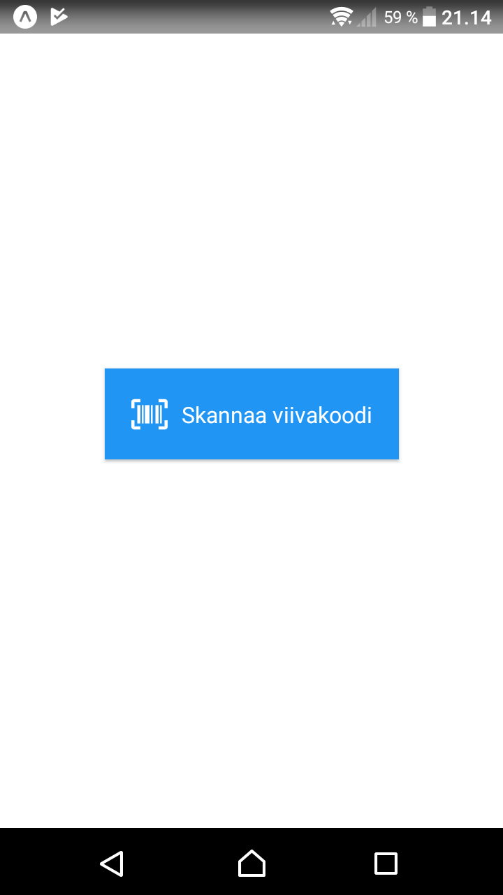
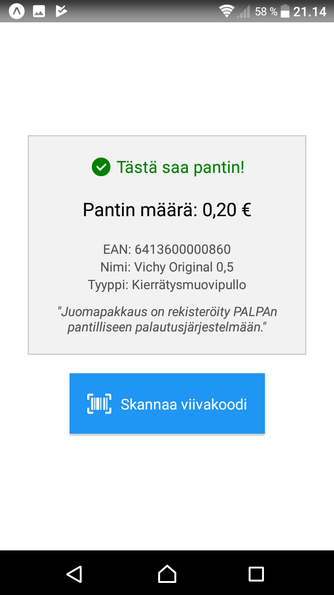
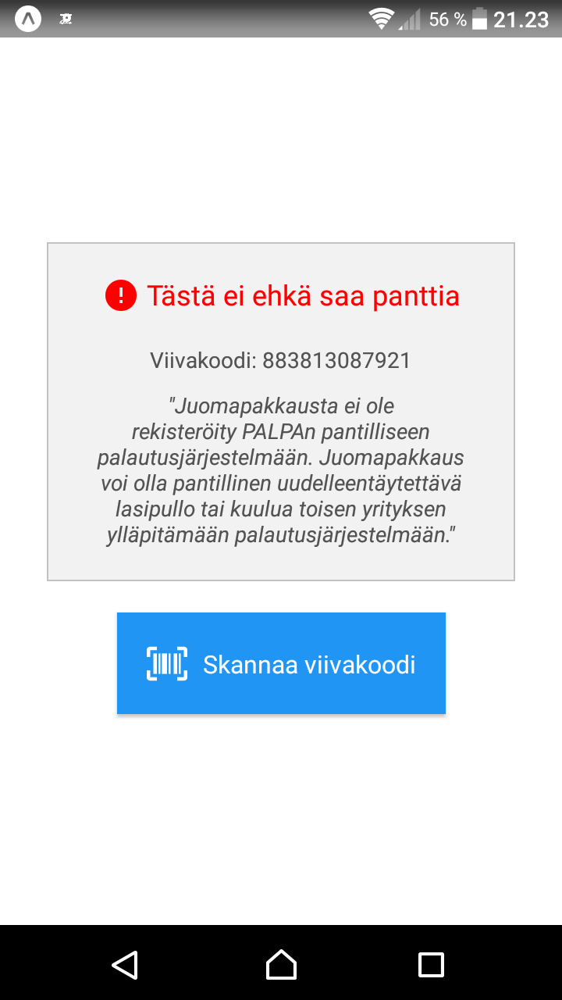

# Panttipullo

React native application to check drinking bottle / can deposit from Palpa (pantillisuus). Intended to be used in Finland only. App uses same APIs than is used in the following page by PALPA: https://extra.palpa.fi/pantillisuus/

**This app is not developed by PALPA**. This app is a private project. In any issues with app, please contact developer in Google Play store.

  

## Supported platforms

Main target is Android.

## Status

This is still work in progress project...
