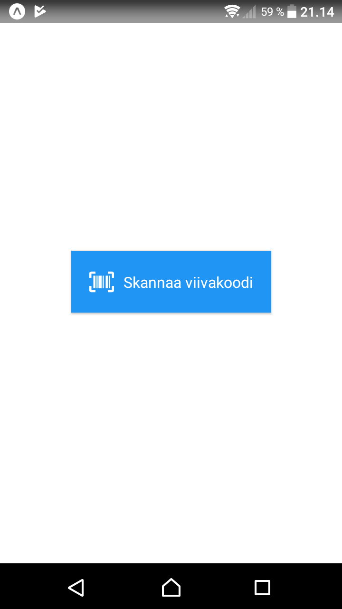

# Panttipullo

## Description

Scan barcode from drinking bottle or can to know if you get deposit or not. Intended to be used in Finland only. 
App fetches deposit information from PALPA api: https://extra.palpa.fi/pantillisuus. This application is a private project, 
it is not developed by PALPA. Please report any issues to developer, not to PALPA.

## Description (Finnish)

Skannaa viivakoodi juomapakkauksesta ja katso saako siitä panttia.
Ohjelma hakee tiedot PALPAn sivuilta: https://extra.palpa.fi/pantillisuus. 
Ohjelma on yksityinen projekti, ei siis PALPAn kehittämä. Ohjelmaan liittyvissä asioissa, ota yhteyttä kehittäjään, ei PALPAan.

      

## Supported platforms

**Main target platform is Android**. You can download the app from the Google Play Store.

App will not be in Apple Store, for iOS, you can use the expo app: https://expo.io/@mvestola/Panttipullo

## Download

The latest stable version of this application can be downloaded to an Android phone
from [the application website in Google Play](https://play.google.com/store/apps/details?id=fi.mvestola.panttipullo).

For iPhone, use Expo app: https://expo.io/@mvestola/Panttipullo

## Documentation

* [Development](./docs/DEVELOPMENT.md)
* [Privacy policy](privacy-policy.md)
* [Release notes](RELEASE-NOTES.md)

## Credits

### Logo

Logo uses creative common licenced images from the [Noun project](https://thenounproject.com):
* beer bottle by Nikita Kozin from the Noun Project
* scan barcode by sandra from the Noun Project
