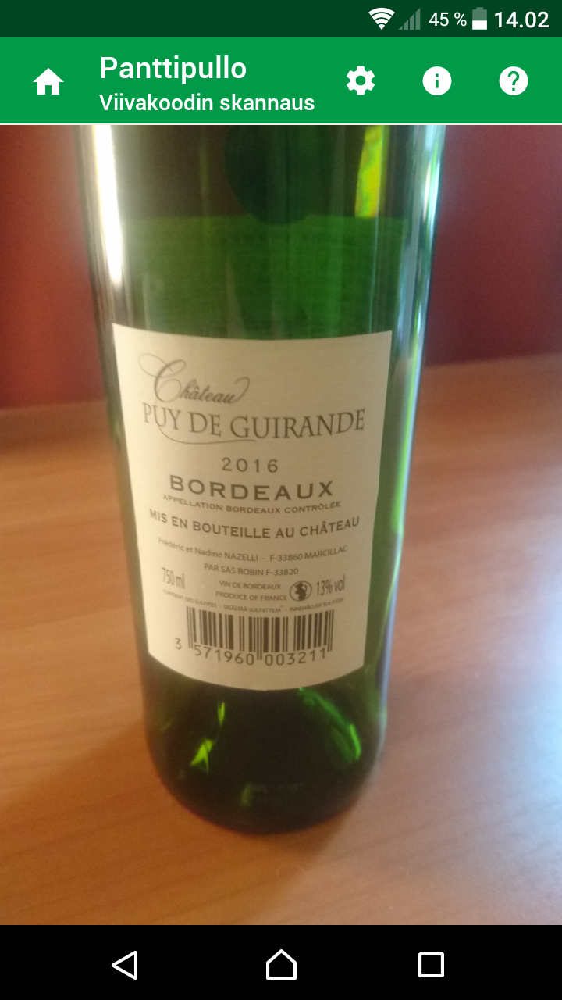

# Panttipullo

## Sovelluksen kuvaus (in Finnish)

Skannaa viivakoodi juomapakkauksesta ja tarkista saako siitä panttia. Tiesitkö, 
että kaikissa Suomessa myytävissä pantillisissa juomapakkauksissa ei ole Palpan panttimerkintää. 
Esim. monista viinipulloista puuttuu panttimerkintä, mutta niistä saattaa silti saada pantin. 
Tämän sovelluksen avulla pystyt helposti skannaamaan viivakoodin esim. viinipullosta tai tölkistä 
ja tarkistamaan saako siitä panttia. 

Sovellus hakee tiedot [Palpan sivuilta](https://extra.palpa.fi/pantillisuus). 
Sovellus on yksityinen projekti, ei siis Palpan kehittämä.

## Application description

Scan barcode from Finnish beverage package to check if you get deposit or not. 
Did you know that not all beverage packages sold in Finland have the deposit mark. 
For example, many wine bottles are lacking the deposit mark but you might still get deposit 
for those bottles also. With the application, you can easily scan barcode from e.g. 
wine bottle or soft drink can to check if you get deposit or not in Finland.

Application fetches deposit information from [Palpa website](https://extra.palpa.fi/pantillisuus). 
This application is a private project, it is not developed by Palpa.

## Screenshots

### Main views

<kbd>
     
</kbd>
  
### Support views

<kbd>
 
</kbd>

## Download

**Main target platform is Android**. The latest stable version of this application can be downloaded to an Android phone
from [the application website in Google Play Store](https://play.google.com/store/apps/details?id=fi.mvestola.panttipullo).

In addition to Google Play store release, you can use [Expo app release](https://expo.io/@mvestola/Panttipullo) with Android but Play Store version is preferred.

This application will not be released in Apple Store because it is too expensive. In addition, due to [limitations made by Apple](https://blog.expo.io/upcoming-limitations-to-ios-expo-client-8076d01aee1a), you can not use Expo app release with iOS. So sorry, no easy way to run this application in iOS, thanks to Apple. If you want to use this application with iOS, you have to build the application yourself by checking out the code and then run it with Expo client, for example.

## Documentation

* [Development](./docs/DEVELOPMENT.md)
* [Privacy policy](privacy-policy.md)
* [Release notes](RELEASE-NOTES.md)

## Credits

### Logo

Logo uses creative common licenced images from the [Noun project](https://thenounproject.com):
* beer bottle by Nikita Kozin from the Noun Project
* scan barcode by sandra from the Noun Project
